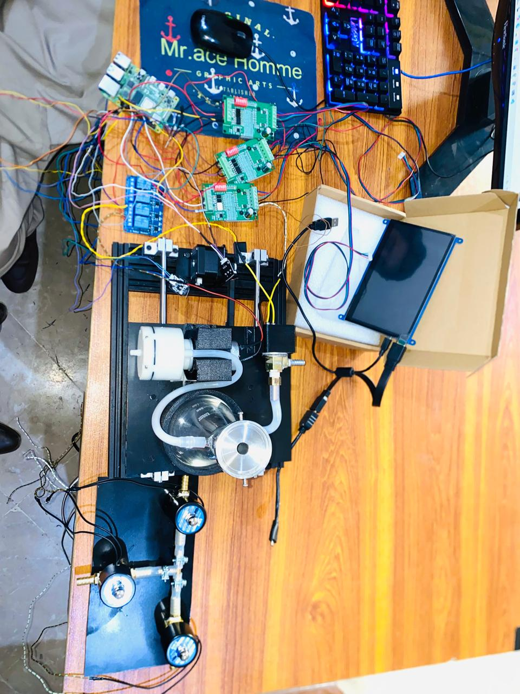
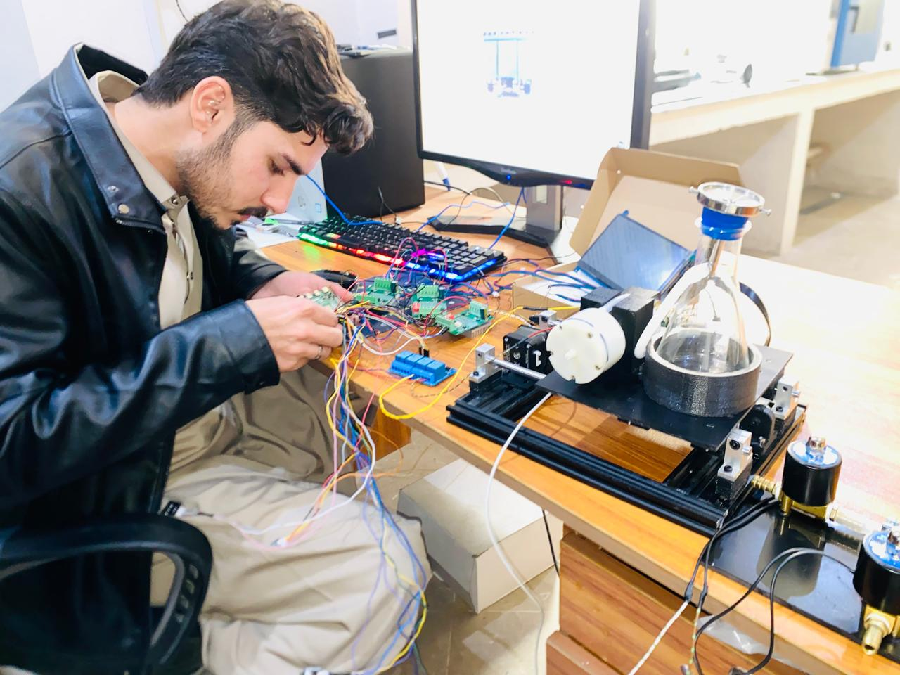

# Automation Microbial Detection System

An IoT-based automation system designed to assist in microbial detection workflows using Raspberry Pi and multiple hardware components.

## Project Status
Currently in the hardware integration and raw wiring phase.

## Hardware Components
- Raspberry Pi
- Stepper Motors
- Stepper Motor Drivers
- Relay Modules
- BTS Motor Driver
- Air Pump
- Solenoid Valves
- Water Level Sensor
- Limit Switches
- 12V Heater
- Camera for image capture
- DC-DC Buck Converter
- Battery Power System

## Hardware Wiring Setup

# Wiring Documentation

A detailed Fritzing wiring diagram will be added once the hardware configuration is finalized.

## Code Overview

### air_pump_bts_control.py
Python script used to control the air pump through a BTS motor driver using Raspberry Pi GPIO PWM signals.

Features:
- Low-speed pump operation
- High-speed pump operation
- PWM-based control

## Software

Python scripts used for:
- Stepper motor control
- GUI motor control
- Hardware interaction

## Future Work

- Complete system automation
- Image capture and microbial detection
- AI-based analysis
- Remote monitoring interface
